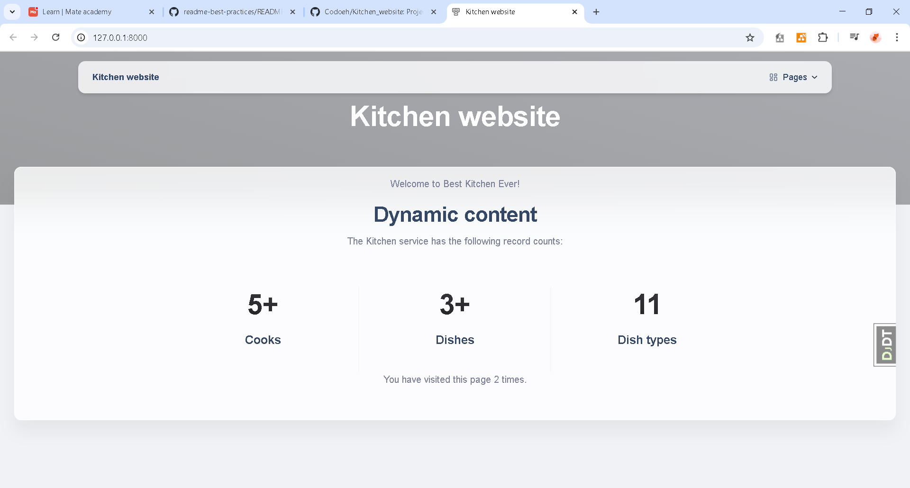

# Kitchen website
Django website to manage kitchen. Contains cooks, dishes and dish types.

## Check it out!

## Installation
Python3 must be already installed.
```shell
git clone https://github.com/Codoeh/Kitchen_website
cd Kithchen_website
python3 -m venv venv
source venv/scripts/activate
pip install -r requirements.txt
python manage.py runserver
```

## Features
* Authentication functionality for Cook/User
* Managing dishes and dish types directly from website interface
* Powerful admin panel for advanced managing

## Demo
